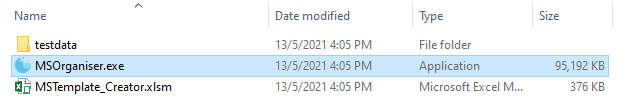

```{r, include = FALSE}
knitr::opts_chunk$set(
  collapse = TRUE,
  comment = "#>"
)
```

# MSOrganiser

MSOrganiser is created to provide users a convenient way to extract 
and organise MRM transition names data exported from mass spectrometry 
software into an Excel or csv file in a few button clicks.

With the addition of the MSTemplate_Creator, the software is also able to 
normalize the peak area with respect to the internal standard’s peak area 
as well as calculate the concentration of the analytes. 

It is currently distributed as platform independent source code under
the MIT license.


## Starting Up

Download the repository and open the dist folder. Inside the dist folder, double click on the file `MSOrganiser.exe` to start




## Extracting Area and RT

Fill in the `Required Input` section such as the `MS_Files`, `MS_FileType` and `Output_Directory`.


Next, under the `Output_Options` click on `Area` and `RT`


Ensure the `Output_Settings` is as follows.


Click on `Start` and let the program run


