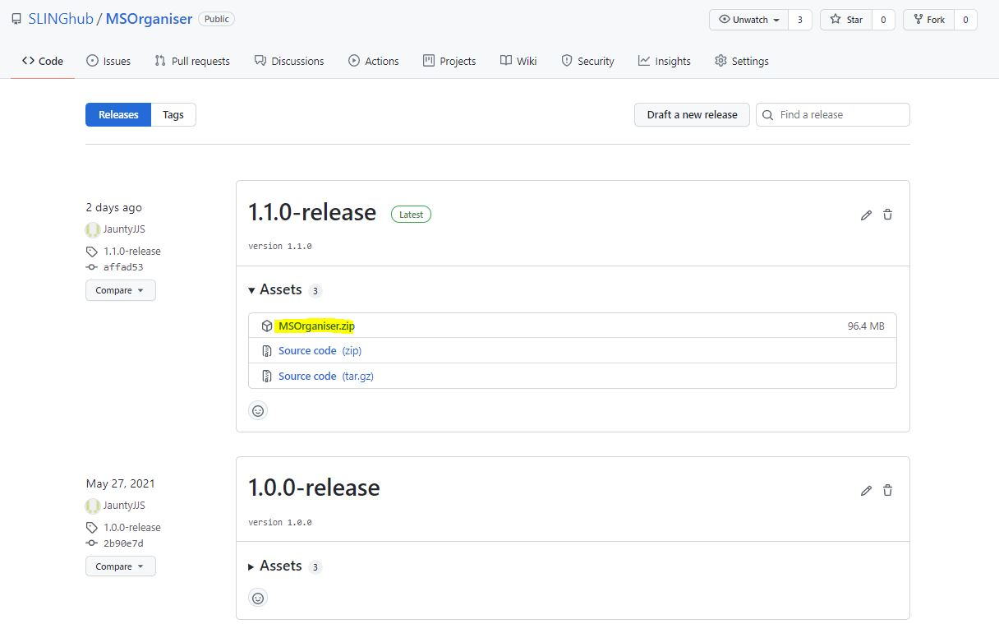
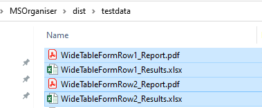

```{r, include = FALSE}
knitr::opts_chunk$set(
  collapse = TRUE,
  comment = "#>"
)
```

# MSOrganiser

<!-- badges: start -->
[](https://github.com/SLINGhub/MSOrganiser/blob/master/LICENSE.md)
<!-- badges: end -->

`MSOrganiser` is created to provide users a convenient way to extract 
and organise MRM transition names data exported from mass spectrometry 
software into an Excel or csv file in a few button clicks.

With the addition of the [`MSTemplate_Creator`](https://github.com/SLINGhub/MSTemplate_Creator), the software is also able to 
normalize the peak area with respect to the internal standard’s peak area 
as well as calculate the concentration of the analytes. 

## Meta

* We welcome [contributions](CONTRIBUTING.md) including bug reports.
* License: MIT
* Think `MSOrganiser` is useful? Let others discover it, by telling them in person, via Twitter or a blog post.
* Please note that this project is released with a [Contributor Code of Conduct](CODE_OF_CONDUCT.md). By participating in this project you agree to abide by its terms.

## Starting Up

Go to the [Releases](https://github.com/SLINGhub/MSOrganiser/releases) section in GitHub.



Download the zip folder. Unzip the folder, double click on the file `MSOrganiser.exe` to start


## Extracting Area And RT

The test csv data file is exported via Agilent MassHunter Quantitative Analysis in wide table form.


Fill in the `Required Input` section such as the `MS_Files`, `MS_FileType` and `Output_Directory`.


Next, under the `Output_Options` click on `Area` and `RT`


Click on `Start` and let the program run


Results files are as follows 




## Calculate Normalised Area And Concentration

To do this, a corresponding annotation file is required.

The content in the annotation file are as follows:


In the `Data_extraction` section, click on `normArea by ISTD` and `normConc by ISTD`. Load the annotation file onto `Annot_File` and press `Start` to let the program run.


When the program has finished running, the results will contain the following sheets including the normalised area and concentration.


## Output Format

The results are output as an Excel file. User can change the output type to as follows


## Transpose Output

By default, the results are represented in a wide table form with Sample Name as the first columns followed by the Transitions. To make the Transition Name as the first column followed by the Sample Names, go to the `Output Settings` section and change the `Transpose_Results` from `False` to `True` and click `Start`


The results file will now look like this


## Long Table Output

There is also an option to output the results in the form of a long table.


## Concatenation Option

When there are several input data file with the same transitions but different sample names in each file, the results can be concatenated by setting the `Concatenate` settings to `Concatenate along Sample Name (rows)`


When there are several input data file with the same sample name but different transitions in each file, the results can be concatenated by setting the `Concatenate` settings to `Concatenate along Transition Name (columns)`

Concatenated results are as follows


## Allow Normalisation With Multiple ISTD

By default, the software will only allow one transition to be normalised by one ISTD. However, during method development, there may be a need for one transition to be normalised by multiple ISTD to see which one is the best one to use. To relax this restriction, ensure that `Allow_Multiple_ISTD` is set to `True`


In this example, the following annotation file will be used


Load the annotation file onto `Annot_File` and press `Start`


The main changes in the results are as follows


