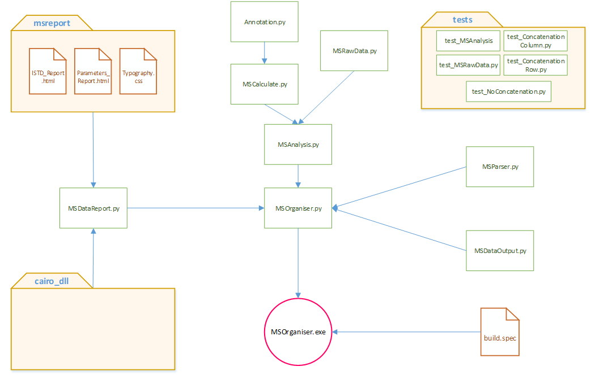

.. MSOrganiser documentation master file, created by
   sphinx-quickstart on Thu Apr 12 11:22:59 2018.
   You can adapt this file completely to your liking, but it should at least
   contain the root `toctree` directive.

MSOrganiser's Technical Documentation
======================================

Introduction
-------------

This documentation will help to explain the functions and modules involved in this software

Code Structure Outline
-----------------------

.. toctree::
   :maxdepth: 2
   :titlesonly:
   :caption: Code Structure Summary:

   analysis/index
   duplicatecheck/index
   fileinput/index
   fileoutput/index
   parser/index
   testunits/index
   wrapper/index